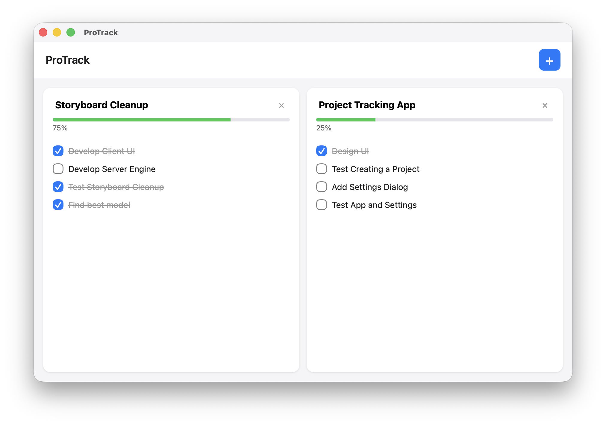
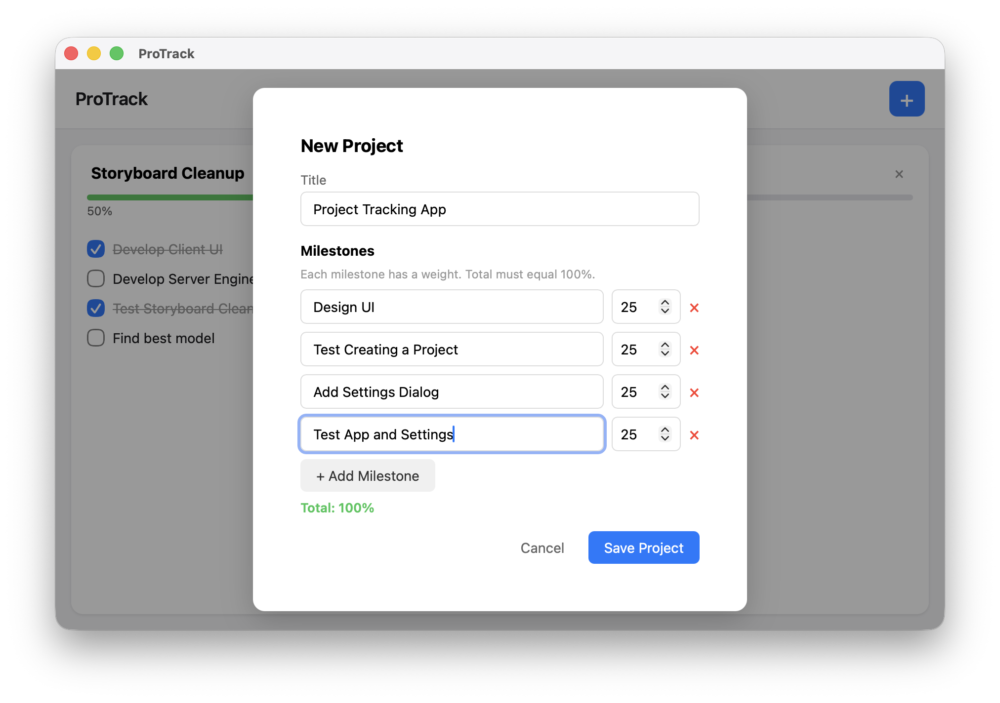
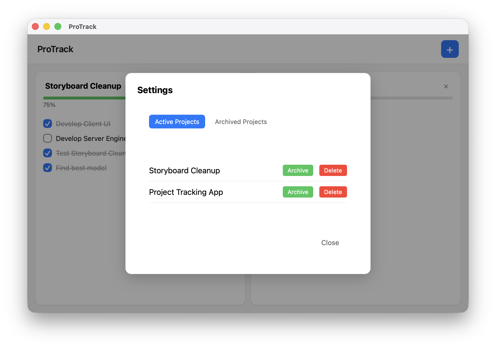

# ProTrack

A simple project tracker for managing milestones and progress. Built with Rust and Tauri v2.



## Features

- Create projects with weighted milestones (totaling 100%)
- Track progress automatically as milestones are completed
- Drag & drop to reorder projects
- Archive and restore projects
- Responsive layout that fills the window

### New Project



Create a project by giving it a title and defining milestones. Each milestone has a weight (percentage), and all weights must total 100%. As you check off milestones, the project's overall progress updates automatically.

### Settings



Manage active and archived projects from the Settings dialog (File > Settings). Archive projects to hide them from your main view, restore them later, or delete them permanently.

## Specifications

| Property | Value |
|----------|-------|
| **Framework** | Tauri v2 |
| **Backend** | Rust |
| **Frontend** | Vanilla HTML/CSS/JavaScript |
| **Window Size** | 1200×800 (min 900×600), resizable |
| **Layout** | Horizontal flexbox, equal-width project cards |
| **Data Storage** | localStorage (JSON) |
| **Platforms** | macOS (Apple Silicon & Intel), Windows, Linux |

### Menu Bar

- **ProTrack > About ProTrack** — Shows app info and credit
- **ProTrack > Quit ProTrack** (⌘Q / Ctrl+Q) — Exits the application
- **File > Settings...** — Opens project management dialog

## Development

```bash
npm install
npm run tauri dev
```

### Building for Production

```bash
npm run tauri build
```

This produces platform-specific binaries in `src-tauri/target/release/bundle/`.

## License

MIT © Dexter Santucci
