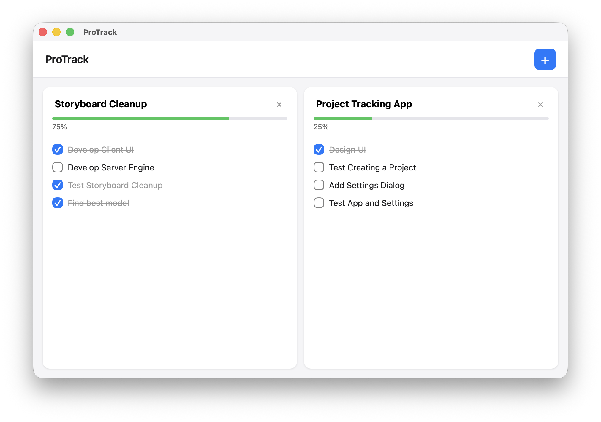
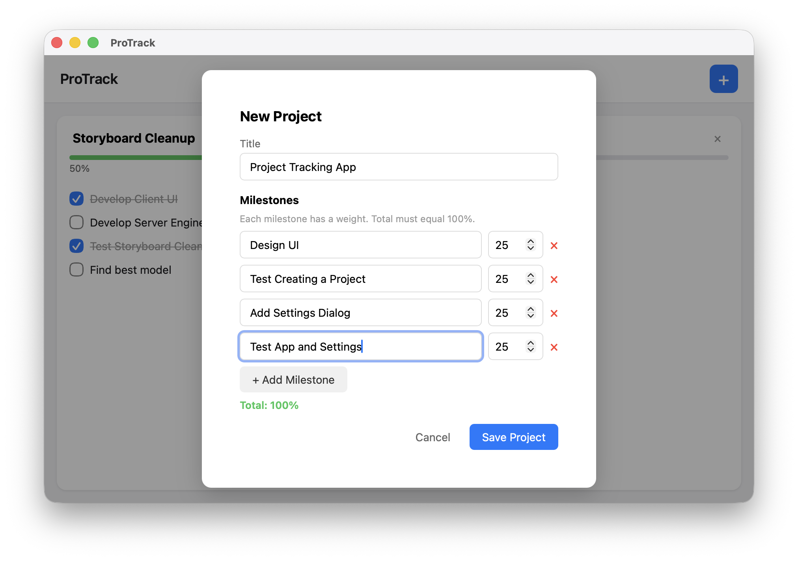
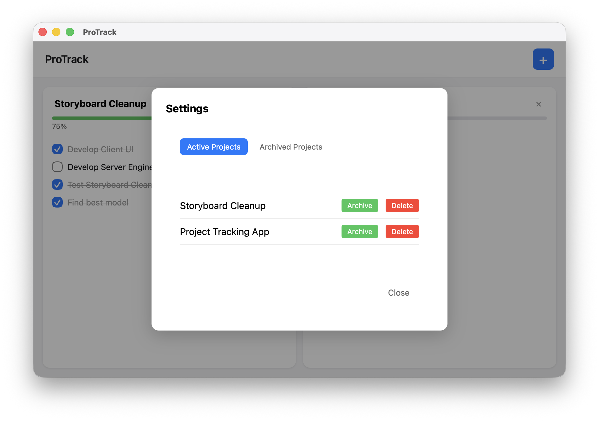

# ProTrack

A simple project tracker for managing milestones and progress. Built with Rust and Tauri v2.



## Features

- Create projects with weighted milestones (always totaling 100%)
- Track progress automatically as milestones are completed
- Edit projects after creation: add, rename, re-weight, and delete milestones
- Click a milestone to edit its text inline; delete with the `×` confirmation dialog
- Weights auto-rebalance to 100% when milestones are added or removed
- Drag & drop to reorder projects
- Archive and restore projects
- Dark / light mode toggle (follows the OS on first launch, remembers your choice)
- Responsive layout that fills the window

### New Project



Create a project by giving it a title and defining milestones. Each milestone has a weight (percentage), and all weights must total 100%. As you check off milestones, the project's overall progress updates automatically.

### Editing a Project

The small `+` button next to a project's title re-opens the project editor, where existing milestones can be renamed, re-weighted, removed, or added. Milestone weights rebalance automatically so the total always equals 100%. On a project card, click a milestone's text to edit it inline, and use the `×` button to delete a milestone (with confirmation).

### Dark Mode

Use the sun/moon button in the top-right of the toolbar to switch between light and dark mode. ProTrack follows your system appearance on first launch and remembers your choice afterwards.

### Settings



Manage active and archived projects from the Settings dialog (File > Settings). Archive projects to hide them from your main view, restore them later, or delete them permanently.

## Specifications

| Property | Value |
|----------|-------|
| **Framework** | Tauri v2 |
| **Backend** | Rust |
| **Frontend** | Vanilla HTML/CSS/JavaScript |
| **Window Size** | 1200×800 (min 900×600), resizable |
| **Layout** | Horizontal flexbox, equal-width project cards |
| **Data Storage** | localStorage (JSON) |
| **Theming** | Light / dark mode via CSS variables |
| **Platforms** | macOS (Apple Silicon & Intel), Windows, Linux |

### Menu Bar

- **ProTrack > About ProTrack** — Shows app info and credit
- **ProTrack > Quit ProTrack** (⌘Q / Ctrl+Q) — Exits the application
- **File > Settings...** — Opens project management dialog

## Development

```bash
npm install
npm run tauri dev
```

### Building for Production

```bash
npm run tauri build
```

This produces platform-specific binaries in `src-tauri/target/release/bundle/`.

## Version History

### v0.2.0 (2026-09-16)

- Edit existing projects: add, rename, re-weight, and delete milestones after creation
- Inline milestone text editing (click the text; Enter/blur saves, Esc cancels)
- Per-milestone delete button with confirmation; completed milestones subtract their percentage
- Project editor lists existing milestones and keeps weights auto-balanced to 100%
- Dark / light mode toggle that follows the OS on first launch and remembers your choice

### v0.1.1 (2026-09-15)

- Custom ProTrack app icon (replaces default Tauri template icon) across all platforms

### v0.1.0 (2026-09-15)

- Initial release
- Project creation with weighted milestones (totaling 100%)
- Automatic progress tracking as milestones are completed
- Drag & drop reordering of project cards
- Archive / restore / delete projects via Settings dialog
- Menu bar: About, Quit (⌘Q), Settings
- Builds for macOS (Apple Silicon), Windows, and Linux

## License

MIT © Dexter Santucci
